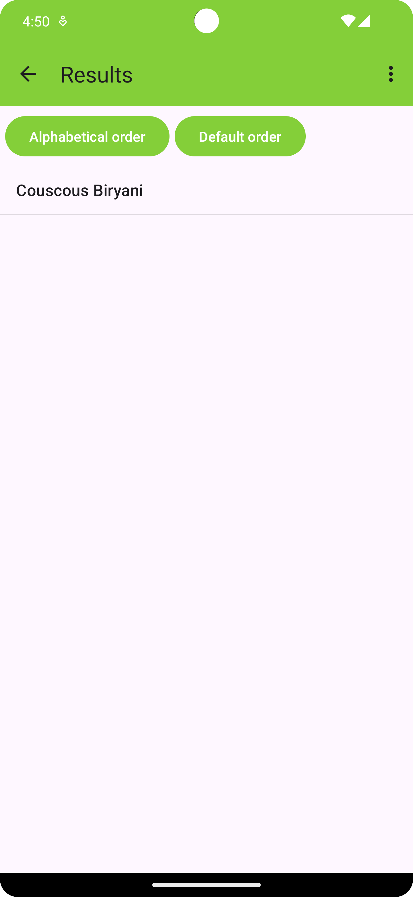
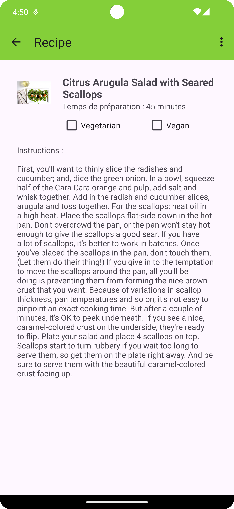

# NaoLibre 
NaoLibre is an open-source Android application and Web application that includes an API for Nantes' public transportation system. It is a project developed by students from the University of Nantes.

## Application Android (NaoFood)
We have developed an Android application that allows users to find cooking recipes based on the name, origin and number of people. You can find more information about the Android application in the [Android README](android/README.md).

<div style="display: flex; gap: 20px;">
    
    
    
</div>

## Web application (NaoLibre)
We have developed a web application that allows users to find information about Nantes' public transportation system. This app is based on the [TAN API](https://data.nantesmetropole.fr/pages/home/). We permit users to find information about the next bus/tramway, if there are any disruptions, and the next departures from a specific stop.

### Start the project (at the root of the project)
begin starting the project start the mongodb service
```bash
sudo service mongodb start
```

after, go into the directory `database` and do
```bash
npm i
npm start
```

Now you can start the projet at the root of the project with the following command:
```bash
npm install
npm run i
npm run start
```
Theses commands will start the API_Tan, API_User and the web application at the same time.

## Project report
You can find the projects reports in the `docs` directory. The reports are in French.
Reports:
- [Quality of development](docs/qualite_dev.pdf)
- [Management](docs/masi.pdf)
- [Data base](docs/qadr.pdf)
- [Automaton](docs/automate.pdf)


## Figma
Link to the [Figma](https://www.figma.com/file/wyVxFN0OtDNcNvC3wY033X/NaoLibre?type=design&node-id=0%3A1&mode=design&t=eMEvawPKe1MDDzKa-1) of the project.

## Team
- [Alexys GROMARD](https://github.com/AlexysGromard)
- [Floran MARTEL](https://github.com/FloranMARTEL)
- [Lancelot JOUAULT](https://github.com/IIXIVII)
- [Clovis LEPORT](https://gitlab.univ-nantes.fr/E228541P)
- [Arthur CHEVREUX](https://gitlab.univ-nantes.fr/E223543G)
