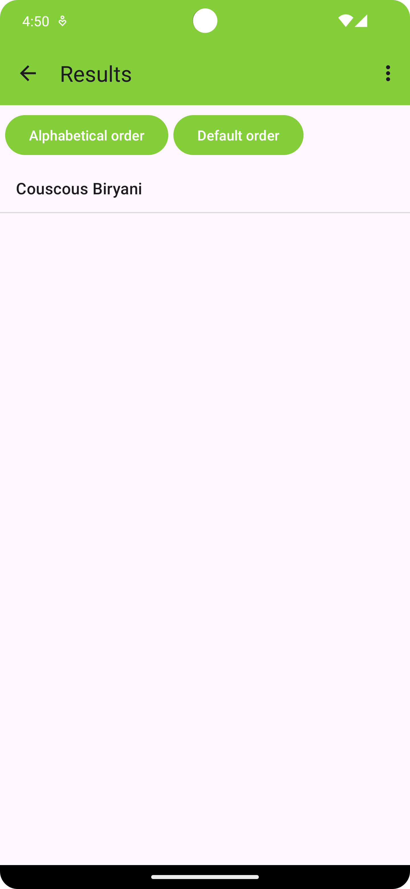

# Application NaoFood (Android)
Ceci est le code source de l'application Android NaoFood. Cette application permet de rechercher des recettes de cuisine en fonction de plusieurs critères. Elle est développée en Kotlin et utilise une API pour récupérer les données.

## Lien du GIT de consigne
Ci-dessous le lien du GIT de consigne pour le projet NaoFood :
[https://gitlab.univ-nantes.fr/iut.info2.dev.mobile/dev.mobile.sae](https://gitlab.univ-nantes.fr/iut.info2.dev.mobile/dev.mobile.sae)

## Catpures d'écran
Voici quelques captures d'écran de l'application NaoFood :
<div style="display: flex; gap: 20px;">
    
    
    
</div>

## Fonctionnalités
- Recherche de recettes de cuisine
- Affichage des résultats de recherche
- Affichage des détails d'une recette
- Recherche d'une recette aléatoire
- Changement de langue (français, anglais)

## Installation
Pour installer l'application NaoFood, il suffit de cloner le projet et d'ouvrir le répertoire `android/projet_android` dans Android Studio. Ensuite, il suffit de lancer l'application sur un émulateur ou un appareil Android.

## Explication de code
### Gestion de la langue (LanguageManager.kt)
Pour gérer la langue de l'application, nous avons créé un objet `LanguageManager` qui permet de changer la langue de l'application. 
```kotlin
/**
 * Classe permettant de gérer la langue de l'application
 * Cette classe permet de changer la langue de l'application et de récupérer la langue actuelle
 */
object LanguageManager {
    /**
     * Change la langue de l'application
     * @param activity Activité de l'application
     * @param langCode Code de la langue à changer
     */
    fun setLocal(activity: Activity, langCode: String)


    /**
     * Récupère la langue actuelle de l'application
     * @param context Contexte de l'application
     * @return La langue actuelle de l'application
     */
    fun getLanguage(context: Context): String 

    /**
     * Récupère la langue du système
     * @return La langue du système
     */
    fun getDeviceLanguage(): String
}
```
Pour pouvoir changer la langue de l'application, il suffit d'appeler la méthode `setLocal` en lui passant l'activité et le code de la langue à changer. Celle-ci va alors commencer par accéder aux préférences partagées puis sauvagarder la langue choisie. Ensuite, elle va créer un objet `Locale` avec le code de la langue choisi et mettre à jour la configuration de l'application avec cette nouvelle langue. Pour finir, elle va appliquer ces changements à l'activité avec `resources.updateConfiguration`. Pour que les changements soient pris en compte, il faut redémarrer l'activité principale.

### Interaction avec l'API (DAO)
La classe `Request` permet de récupérer des données de recettes à partir d'une API fournie par `Spoonacular`. Détaillons les fonctionnalités de la classe étape par étape :
```kotlin
class Request {
    companion object {
        val kTorClient = HttpClient(OkHttp) {
            install(HttpTimeout) {
                requestTimeoutMillis = 15000L
                connectTimeoutMillis = 15000L
                socketTimeoutMillis = 15000L
            }
            install(ResponseObserver) {
                onResponse { response ->
                    println("HTTP status: ${response.status.value}")
                }
            }
        }
    }

    fun getRecipe(recipe : String, number : String, origine : String) : MutableList<Recipe> {
        lateinit var result : String
        val recipes = mutableListOf<Recipe>()
        runBlocking(Dispatchers.IO) {
            val response = kTorClient.get("https://api.spoonacular.com/recipes/complexSearch?apiKey=494664f29dd1486996c26818904b2437&number=$number&query=$recipe&cuisine=$origine")
            result = response.body<String>()
           // val jsonData = org.json.JSONObject(result)
            val jsonData = JSONObject(result)
            val resultsArray = jsonData.getJSONArray("results")
            for (i in 0 until resultsArray.length()) {
                val resultObject = resultsArray.getJSONObject(i)
                val id = resultObject.getInt("id")
                val title = resultObject.getString("title")
                val image = resultObject.getString("image")

                val recipe = Recipe(id = id, title = title, image = image)
                recipes.add(recipe)
            }
        }
        return recipes
    }

    fun getRecipeDetail(id:String) : Recipe{
        lateinit var result : String
        val recipe : Recipe
        runBlocking(Dispatchers.IO) {
            val response = kTorClient.get("https://api.spoonacular.com/recipes/$id/information?apiKey=494664f29dd1486996c26818904b2437")
            result = response.body<String>()

            // val jsonData = org.json.JSONObject(result)
            val jsonData = JSONObject(result)
            recipe = Recipe(
                id = jsonData["id"] as Int,
                image = jsonData["image"] as String,
                readyInMinutes = jsonData["readyInMinutes"] as Int,
                servings = jsonData["servings"] as Int,
                instructions = jsonData["instructions"] as String,
                title = jsonData["title"] as String,
                vegan = jsonData["vegan"] as Boolean,
                vegetarian = jsonData["vegetarian"] as Boolean,

            )
        }
        return recipe
    }

    fun getRandomRecipe():Recipe {
        val url = "https://api.spoonacular.com/recipes/random?apiKey=494664f29dd1486996c26818904b2437"
        lateinit var result : String
        val recipe : Recipe
        runBlocking(Dispatchers.IO) {
            val resp = kTorClient.get(url)
            result=resp.body<String>()

            var jsonData = JSONObject(result)
            val js = jsonData["recipes"] as org.json.JSONArray
            val data = js[0] as org.json.JSONObject

            recipe = Recipe(
                id = data["id"] as Int,
                image = data["image"] as String,
                readyInMinutes = data["readyInMinutes"] as Int,
                servings = data["servings"] as Int,
                instructions = data["instructions"] as String,
                title = data["title"] as String,
                vegan = data["vegan"] as Boolean,
                vegetarian = data["vegetarian"] as Boolean,
                )
        }
        return recipe
    }
    
}
```
1. Configuration du client HTTP grâce à un compagnon object : 

L'objet companion crée une instance unique de `HttpClient` en utilisant la bibliothèque `Ktor`.
Ce client est configuré avec un délai d'expiration de 15 secondes pour les requêtes, les connexions et les sockets via l'installateur HttpTimeout.
Un autre installateur, `ResponseObserver`, est utilisé pour simplement afficher le code d'état HTTP chaque fois qu'une réponse est reçue.

2. Effectuer des requêtes API (getRecipe, getRandomRecipe, getRecipeDetail):

La classe propose trois fonctions pour interagir avec l'API Spoonacular : 
- getRecipe(recette, nombre, origine): Cette fonction prend trois arguments - le nom de la recette, le nombre de recettes souhaité et le type de cuisine. Elle renvoie les recettes correspondants aux paramètres.
- getRandomRecipe(): Cette fonction récupère une recette `aléatoire`.
- getRecipeDetail(id): Cette fonction prend un ID de recette et récupère les `détails` de cette recette spécifique.

Les trois fonctions suivent un schéma similaire:

- Elles définissent une variable `result` pour stocker la réponse de l'API sous forme de chaîne.
- Elles utilisent `runBlocking` des coroutines Ktor pour exécuter des appels réseau sur un thread en arrière-plan (Dispatchers.IO).
- Dans le bloc de `coroutine`, elles utilisent le `kTorClient` configuré pour effectuer une requête GET vers le point de terminaison API approprié. 
- L'URL est construite en fonction de la fonction appelée (par exemple, inclut des paramètres de recherche de recette pour getRecipe).
- Le corps de la réponse est ensuite analysé en tant que chaîne et stocké dans la variable result.
- Elles analysent ensuite le contenu JSON de result à l'aide de la bibliothèque `org.json` :
    -  getRecipe et getRandomRecipe attendent un `tableau de recettes` dans la réponse, donc ils analysent le JSON pour obtenir ce tableau et l'itèrent pour extraire les détails de chaque recette.
    - getRecipeDetail attend un seul objet recette dans la réponse, il analyse donc le JSON pour obtenir cet objet directement.
- Enfin, elles créent un objet `Recipe` (en supposant qu'une classe Recipe est définie ailleurs) avec les informations extraites et l'ajoutent à une liste (recipes pour getRecipe) ou retournent l'objet recipe unique.

### Modèle Recipe

La classe Recipe permet de stocker un objet recette renvoyé par l'API en ne gardant que les attributs nécessaires pour notre application.

```kotlin 
@Parcelize
data class Recipe(
    val id: Int,
    val image: String,
    val readyInMinutes: Int = 0,
    val servings: Int = 0,
    val instructions: String = "",
    val title: String,
    val vegan: Boolean = false,
    val vegetarian: Boolean = false,
) : Parcelable {

     override fun toString() : String {
         return title
     }
     
}
```

1. Recipe est une Data class qui implémente `Parcelable`:

 Parcelable permet d'automatiser la conversion entre la classe et un format Parcelable compatible avec les Intent. Afin, de transférer les recettes d'un activité à une autre.

2. `Propriétés` de la classe Recipe :

La classe Recipe définit plusieurs propriétés qui stockent des informations sur une recette, notamment son ID, son image, son temps de préparation, le nombre de portions, ses instructions, son titre, et si elle est végétalienne ou végétarienne.

3. `Méthode` toString() :

La méthode toString() est redéfénie pour renvoyer simplement le titre de la recette. Cela est utilisé lors de l'affichage de la listview afin de n'avoir que les titres qui s'affichent.

## Contributeurs
- [Alexys GROMARD](https://github.com/AlexysGromard)
- [Floran MARTEL](https://github.com/FloranMARTEL)
- [Lancelot JOUAULT](https://github.com/IIXIVII)
- [Clovis LEPORT](https://gitlab.univ-nantes.fr/E228541P)
- [Arthur CHEVREUX](https://gitlab.univ-nantes.fr/E223543G)
