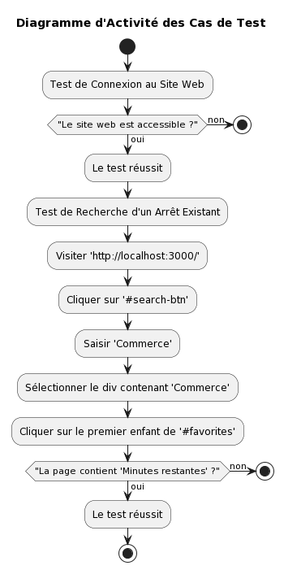

# Rapport - Qualité́ de développement
## Introduction
Dans le cadre de la SAE du 4ème semestre, nous avons réalisé un site web React.js permettant d'intéragir avec une API REST Naolibe (Service de transport en commun de la ville de Nantes). Nous avons également déployé notre propre API REST pour gerer les utilisateurs ainsi que les différentes informations qu'ils peuvent ajouter concernant un transport en commun (Affluence).

## Équipe de projet
Ce rapport a été préparé par :
- Alexys GROMARD
- Floran MARTEL
- Lancelot JOUAULT
- Clovis LEPORT
- ARTHUR CHEVREUX

Equipe : eq_01_01

## Informations complémentaires
📍 IUT de Nantes (Département Informatique)</br>
📆 Quand : 2024 (4ème semestre)

## Sommaire
1. [Tests de l'interface UI/UX](#tests-de-linterface-uiux)

### Tests de l'interface UI/UX
Pour tester l'interface UI/UX, nous avons utilisé l'outil [Cypress](https://www.cypress.io). Cet outil nous a permis de tester les différentes fonctionnalités de notre site web (avec lequel l'utilisateur peut intéragir) et de vérifier que les différentes pages de notre site web sont bien accessibles en fonction de tel ou tel action de l'utilisateur.
Dans le repertoire `web-app` de notre projet, vous pouvez retrouver un repertoire `cypress` qui contient les différents tests que nous avons réalisé.
Nous avons réalisé 2 types de tests :
- Les tests sur l'API REST Naolibe : Ces tests permettent de vérifier que les actions de l'utilisateur avec les données de l'API REST Naolibe sont bien effectuées.
- Les tests sur notre propre API REST : Ces tests permettent de vérifier que les actions de l'utilisateur avec les données de notre propre API REST sont bien effectuées (c-a-d les données concernant les utilisateurs et les affluences).

Vous pouvez exécuter les tests avec la commande suivante (vous devez démarrer l'application web, l'API_Tan et l'API_User avant d'exécuter les tests) :
```bash
cd web-app
npm install
npx cypress open
```

Après avoir exécuté la commande, une fenêtre s'ouvrira avec différentes options. Cliquez sur l'option Test E2E pour accéder aux tests. Ensuite, ouvrez votre navigateur pour accéder à l'application et exécuter les tests.

#### Tests sur l'API REST Naolibe
Les tests sont les suivants :
```javascript
/**
 * This test checks if the website can be accessed
 */
describe('Connexion to website', () => {
    ...
})

/**
 * This test checks if the search bar can be used
 */
describe('search an existing stop', () => {
    ...
})
```


#### Tests sur notre propre API REST
Les tests sont les suivants :
```javascript
/**
 * This test checks if the website can be accessed
 */
describe('Connexion to website', () => {
    ...
}),

/**
 * register an account
 * This test checks if an account can be registered with the website
 */
describe('register an account', () => {
    ...
})

/**
 * Delete an account
 * This test checks if an account can be deleted with the website
 */
describe('Delete an account', () => {
    ...
})
```
